import Figure from "@/components/Figure.astro";

The geodesic distance is the distance between 2 points along the surface of the object. In this project we will examine the ways to find them and see the ways to use these distances. Finally, we will deep dive on shape descriptor algorithms like iso-curve signature and bilateral maps.

## Idea behind Geodesic Distances

In the area of digital geometry processing, geodesic distances in 3D meshes helps us a lot in lots of fields because of it's properties like being invariant to different poses opposed to the euclidean distances.

In 3D world when we want to calculte the distance between two vertices, we will simply find the vector between them, and get the magnitude of it. This will result in a Euclidean distance, we can imagine it like a line which connects these vertices. However, this distance is not much usefull if we ever want to inspect the meshes. The distance between vertices will change with the pose and scale of the mesh. We need something invariant to these effects. We can think of it like our height doesn't change when we sit down. Luckily, we have a measurement which is called geodesic distance.

We can think a 3D mesh as an undirected weighted graph. In this graph weight of edges are the distances between vertices. If we find the shortest path between two vertices the distance of the path will be the geodesic distance between these vertices. If we paint these path on our mesh we can clearly see that our path is on the surface.

<Figure caption="Red line is geodesic distance and the blue line is the euclidean distance.">
  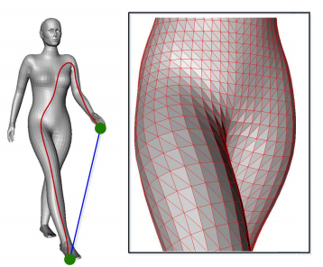
</Figure>

## Ways to find Geodesic Distances between vertices

Thankfully, we have many algorithms to calculate the shortest path between vertices in weighted graphs like Dijkstra and Depth-First Search (DFS) etc. These will provide us an easy way to calculate euclidean distance. However, there is a problem. The shortest path on the surface doesn't need to be on the edges between vertices, it can pass through the faces.

<Figure caption="Comparison between different paths.">
  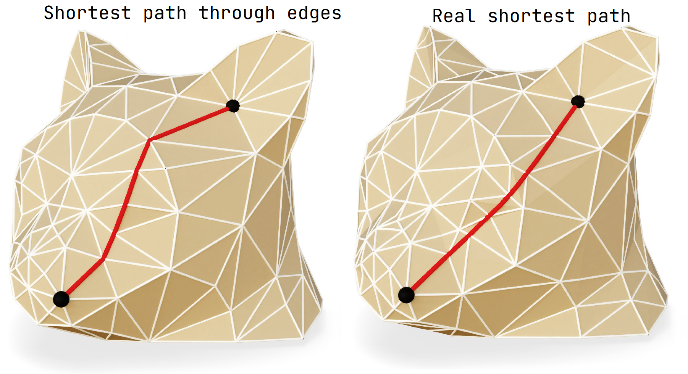
</Figure>

There are algorithms to better estimate the real shortest path like Fast Marching algortihm, but they are out of scope of this project.

## A glance to Dijkstra's shortest path algorithm

In this project, we will use Dijkstra's shortest path algorithm to get the geodesic distances. The input of the algorithm is a source vertex, and the algorithm find the distances between all the other vertices.

In short, the algorithm starts with setting all distances from the source vertex with maximum values and the source vertex with 0. In every iteration, we pick the vertex with least distance. After that, we check wheter the neighbour vertices can be reachable from the vertex we pick with shorter path. In these checks we will save the previous vertices to calculate the shortest path in the end.

In our case we saved our meshes into our memory with structures which represents weighted directed graphs. We will just apply the algorithm to find shortest paths to every other vertex.

<Figure caption="Shortest path drawn on the mesh with red.">
  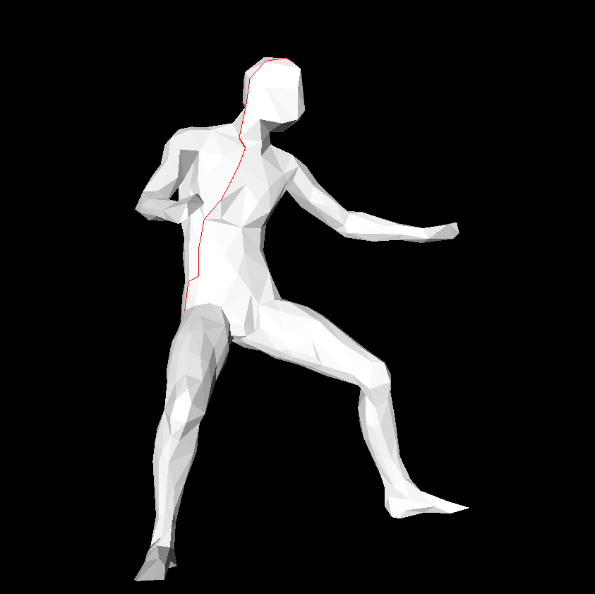
</Figure>

The performance of it can vary with the data structure we use for storing distances. The main reason behind this is the picking the minimum distance from all the vertices. The types of heap with it's capabilities of getting the minimum element with constant times or faster times can help to speed up things a lot. However, because of the implementation details like pointer calculations, the difference cannot be seen in small sizes or in some compilation techniques.

<Figure caption="Difference in timings calculating an N × N matrix of shortest distances between vertices.">
  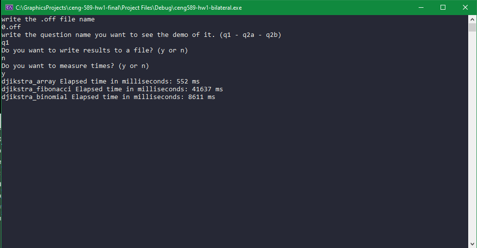
</Figure>

## Using Geodesic Distances

The properties of the geodesic distances enable us to use it on applications like sampling, shape descriptors and similarity comparisions.

In example in the similarity comparisions, we may need to compare meshes with different rotations, deformations and scaling (like mirroring). If we compare the geodesic distances between these meshes we will see less differences from euclidean distances.

In this project, we will focus on shape descriptors.

## Shape Descriptors

To get information about shapes with less data, we need shape descriptors. In normal settings, we will save the vertex positions and indices of a mesh. This can help us to know the shape, but it can get too hard to comprehend with large numbers of faces.

A good shape descriptor needs to have following properties; fast to compute, intuitive, fully automatic and invariant to transformations. There are many descriptors with some of these properties, but they all have some cons which will come with it. This means, a perfect shape descriptor doesn't exist (yet hopefully).

<Figure caption="A shape descriptor called light field which uses 10 different angle silhouette images to compare the meshes.">
  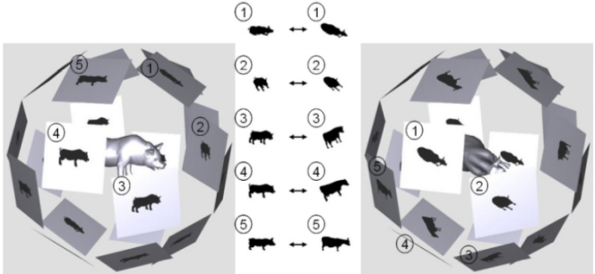
</Figure>

In the next sections, we will dive in some local shape descriptors, which have the information from the one vertex or some area of the shapes.

## Geodesic Iso-Curve Signatures

This method aims to have a local descriptor that improves the correspondence and segmentation quality. The idea behind it is to calculate the total lengths of the iso-curves (curves that will have the same distance to a given point).

In the paper, there is a method proposed to estimate the length of these curves with finding the faces which the curve will intersect. The total sum of these will be our iso-curve length. In my implementation I used my dijkstra implementation to get the geodesic distances. I found the faces which intersects the iso-curve by checking wheter the edges have the wanted distance value when linearly interpolating them.

After calculating these distances, If we will put these values to a line graph the result is our geodesic iso-curve signature.

<Figure caption="The iso-curves of a mesh whose colors are interpolated with respect to their distances to the source vertex.">
  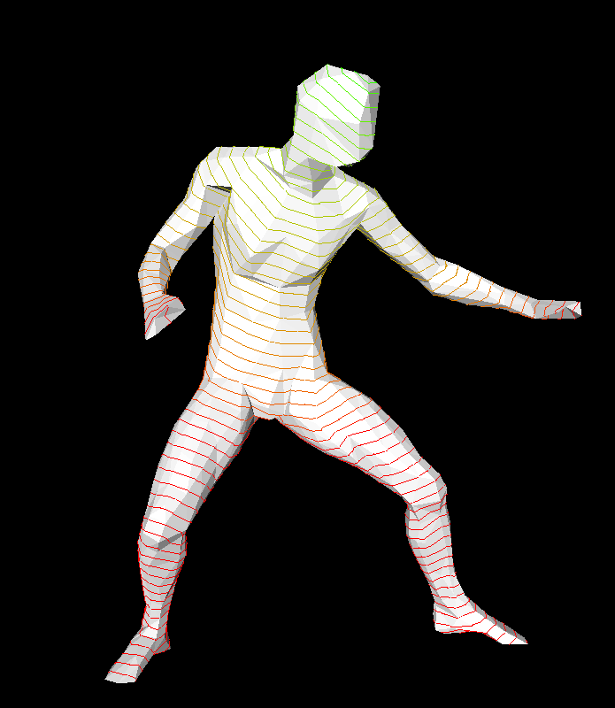
</Figure>

<Figure caption="Geodesic iso-curve signature. The y axis shows the total length and x axis shows the distance of the iso-curve from the vertex.">
  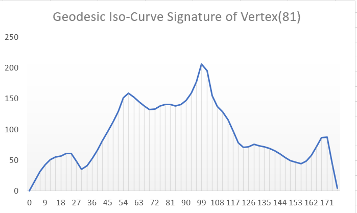
</Figure>

## Bilateral Maps

The main difference of this method is it uses two points on the surface of the character to define a descriptor. With this approach we can easily define our region of interest for better local shape matching. The region of interest can be further filtered to meet our needs.

In the paper, after finding the shortest path between these points (dijkstra's algorithm is used in our implementaion) we will decide our region of interest. The vertexes which are close to our path is in our region of interest. After this step the area can be filtered in different ways. In our implementation there is no filtering. Finally, we will calculate triangular areas of our region of interest and create an histogram which stores the area which varies with the distance of the our prefered vertex. This choice of the vertex can alter the results. Because of this, `(v1,v2)` is not equal to `(v2,v1)` in the context of this method despite using same path.

<Figure caption="The mesh is colored according to its distances to the path between vertices.">
  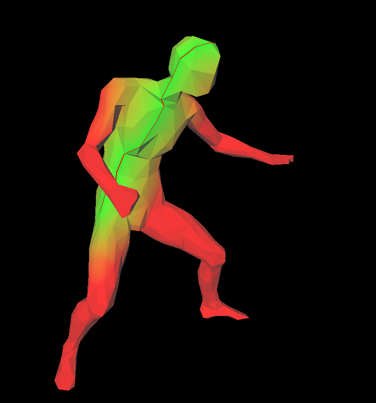
</Figure>

<Figure caption="The two end points of our path give different results. These histograms are our bilateral maps.">
  

    

      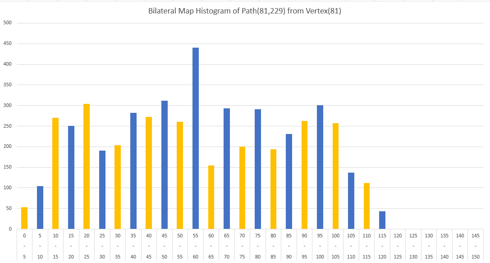
    

    

      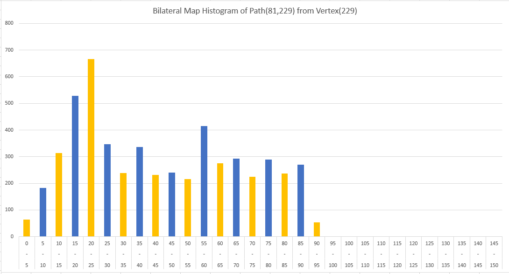
    

  

</Figure>

During my testings, I tested my algorithm in a more complex mesh to find the efficiency. The results were not so good with the array version of the dijkstra's algoritm, but it improved with the heap versions. In the end, I chose a short path, and show the different segments of the ROI in for the histogram.

<Figure caption="The different colors stand for different bars of our histogram.">
  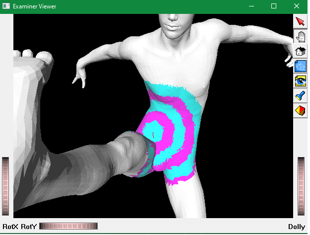
</Figure>

<Figure caption="The mesh is colored according to its distances to the path between vertices.">
  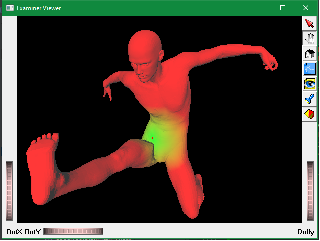
</Figure>

## Final words

Through the project, the main takeaway is there are many methods to describe and process the mesh. The field of the digital geometry is full of fun subjects like these!

## References

Yusuf Sahillioğlu, Lecture Slides from CENG589 Digital Geometry Processing, Middle East Technical University

Gehre, A., Bommes, D., & Kobbelt, L. (2016). Geodesic Iso-Curve Signature. Vision, Modeling & Visualization. The Eurographics Association.

Van Kaick, O., Zhang, H., & Hamarneh, G. (09 2013). Bilateral Maps for Partial Matching. Computer Graphics Forum (CGF). doi:10.1111/cgf.12084
