import Figure from "@/components/Figure.astro";

When I started my journey with Computer Graphics, I found a fun little book called "Ray Tracing in One Weekend". I was mesmerized by the output images that contained some good-looking spheres. I followed that book and implemented a basic ray tracer with different materials and sampling. For simplicity, the book only covered scenes with spheres. That journey led me to some interesting topics such as importance sampling, the insides of real-world cameras, and properties of light. With the start of my master's Degree, I jumped back on this journey with a broader vision and more importantly "triangles".

<Figure caption='My result from "Ray Tracing in One Weekend"'>
  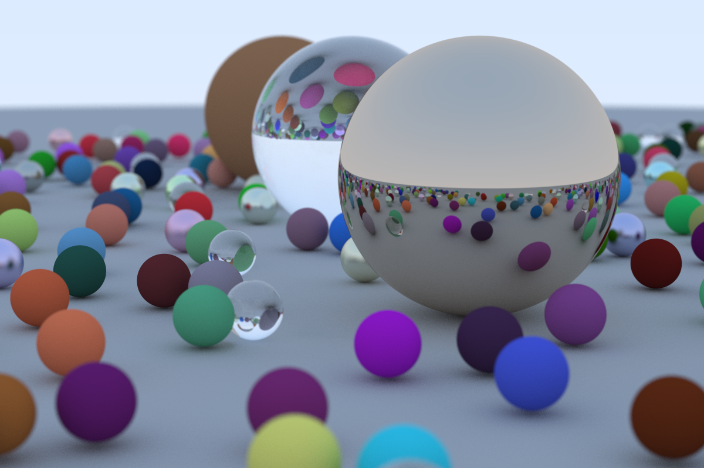
</Figure>

## Starting from the Basics

In this version, we started with a simpler abstraction over ray tracing. Every pixel is sampled once, and every light source is checked for basic Blinn-Phong shading calculations. The basic material has diffuse, specular, and ambient reflectance values for each color channel. I implemented the Möller–Trumbore intersection for triangle ray intersections and used standard library features like future and async for multithreaded implementation.

<Figure caption="Bunny with one light source and basic material, rendered in 1062 ms">
  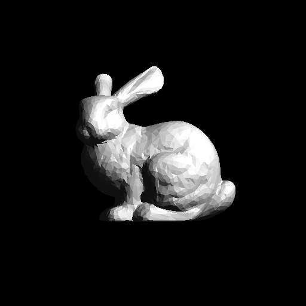
</Figure>

## Mirror Materials 

For mirror materials, after the intersection, a reflected ray is traced to calculate the light coming from the scene. In practice this could happen infinite times, so we need a limit for the traced ray reflected from the mirror materials.

<Figure caption="Sphere with mirror material, rendered in 589 ms">
  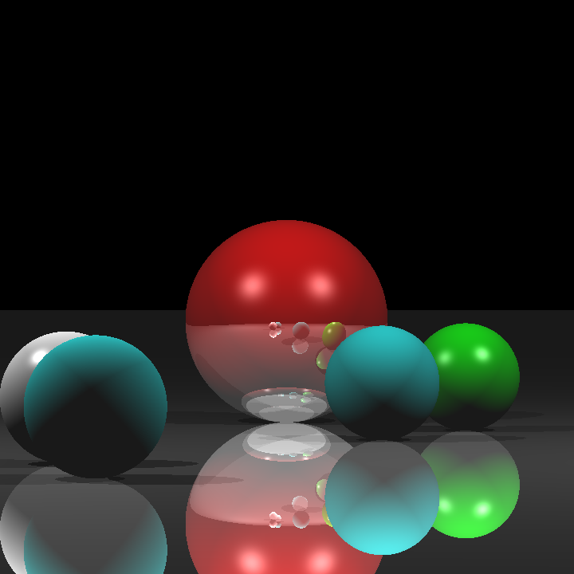
</Figure>

## Dielectric and Conductor Materials

For transparent objects, we need to trace a refracted ray from the intersection point in addition to the reflected ray. We can calculate the direction of the refracted ray according to Snell's Law. 
After this calculation we need to trace two more rays, however, to decide the energy distribution (i.e. which ray carries more light toward the camera) we can use Fresnel equations. These equations specify an object's reflections for light polarization states. For refracted rays we also need to calculate attenuation to calculate the absorption of the energy inside of a transparent material, we will use Beer's Law for this calculation. With all things added, we can output nice-looking transparent objects.

For conductors, we will omit the refracted ray and only use the Fresnel equations for the energy percentage of the reflected ray.

<Figure caption="Conductor and dielectric spheres in the Cornell box, rendered in 751 ms">
  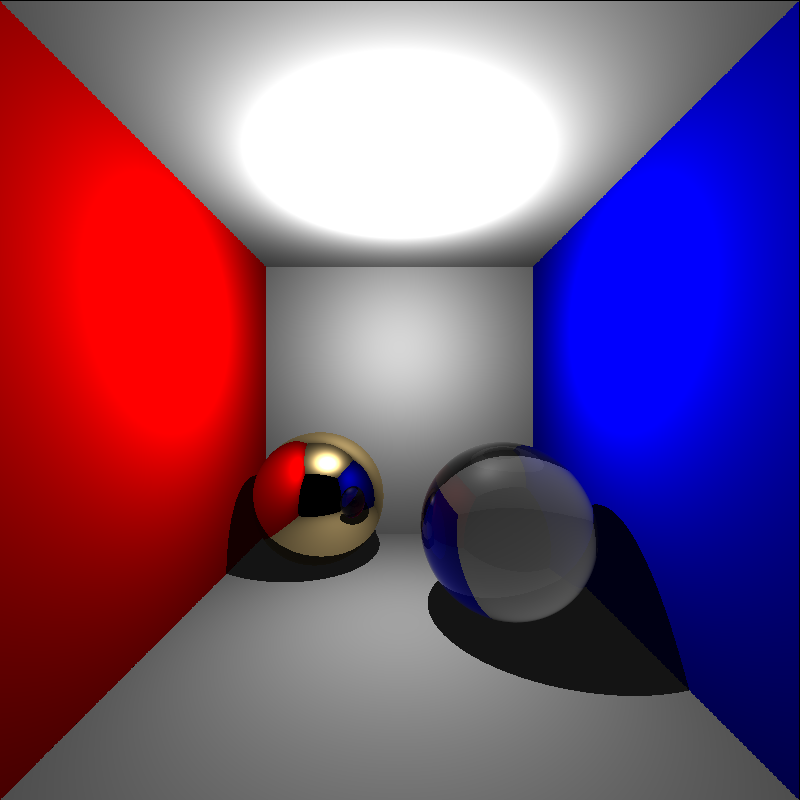
</Figure>

## More Scenes

<Figure caption="Rendered in 7420 ms">
  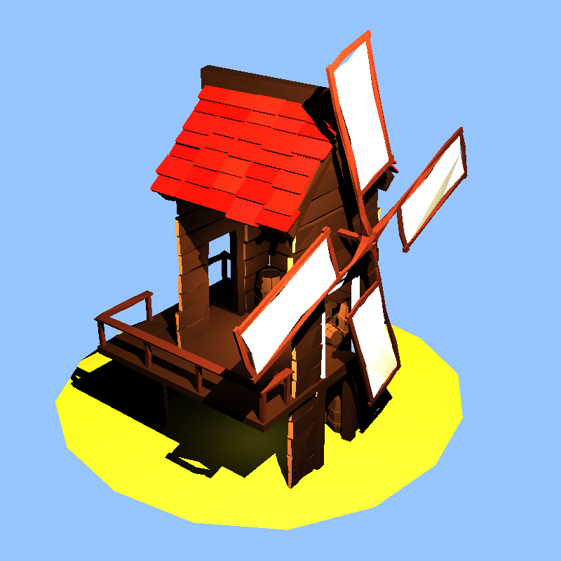
</Figure>

<Figure caption="Rendered in 4138 ms">
  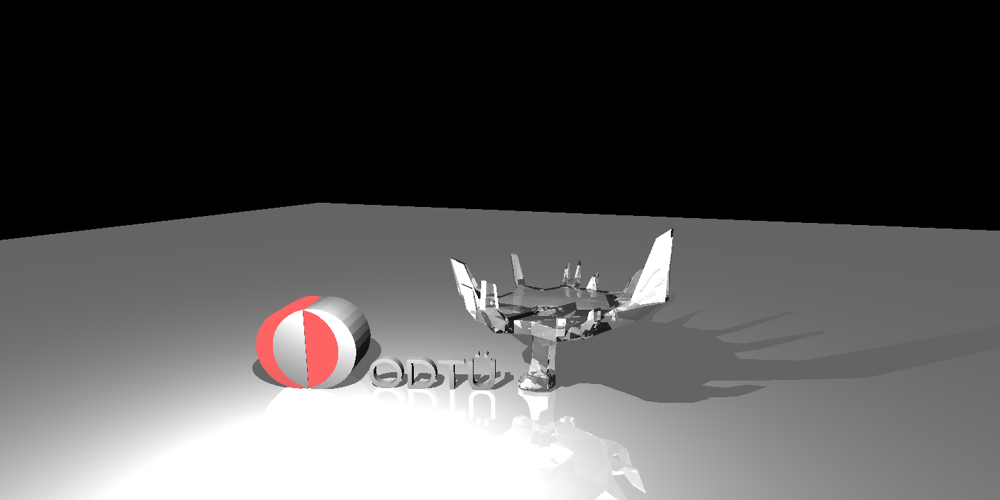
</Figure>

<Figure caption="Rendered in 2551 ms">
  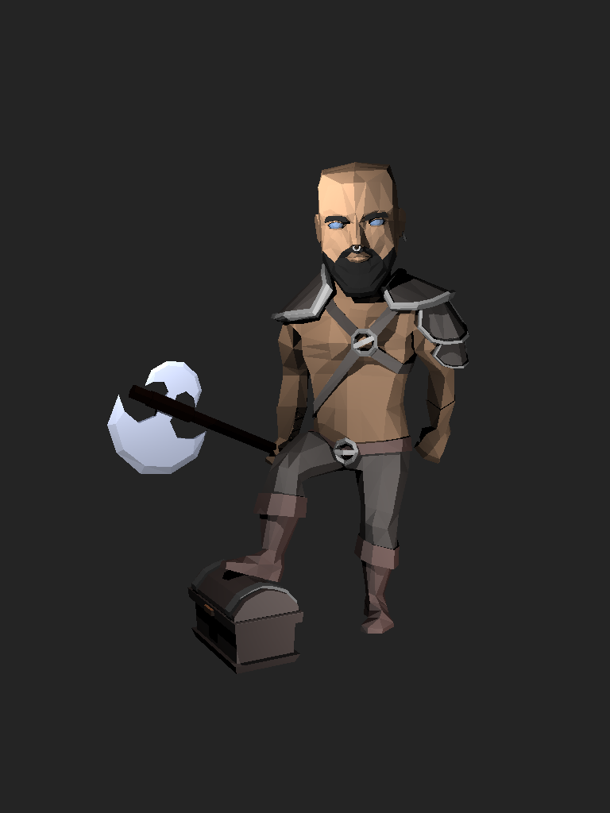
</Figure>

<Figure caption="Rendered in 9301 ms">
  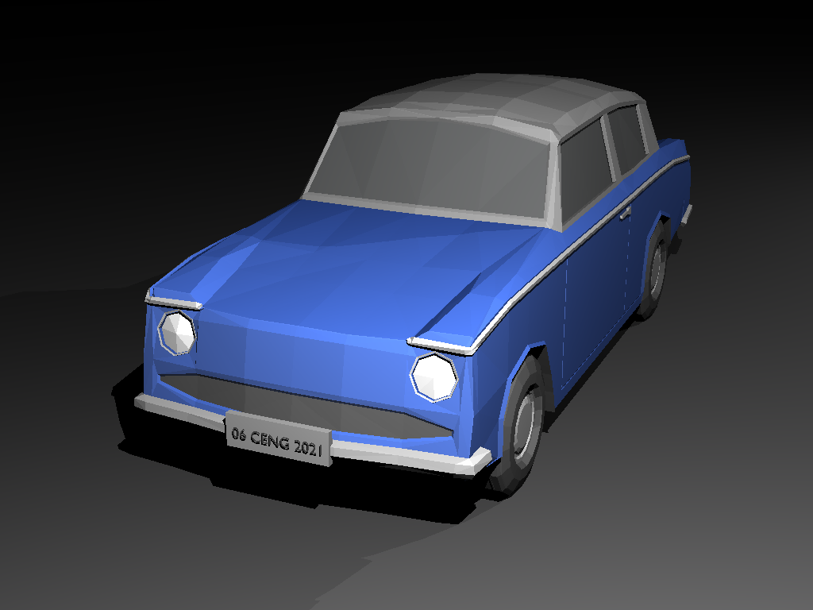
</Figure>

<Figure caption="Rendered in 9279 ms">
  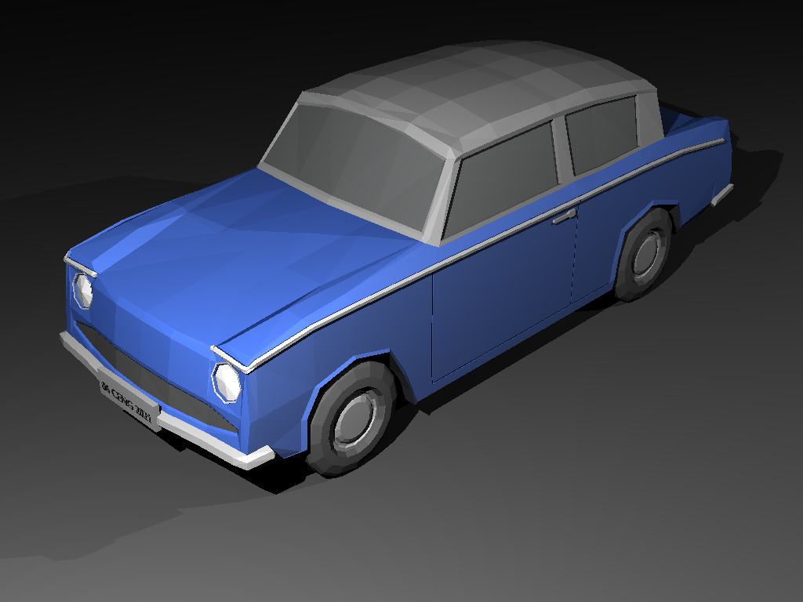
</Figure>

<Figure caption="Rendered in 736 ms">
  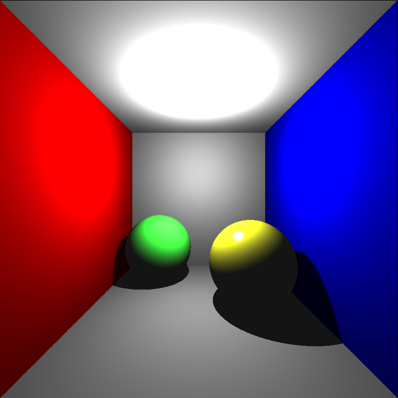
</Figure>

<Figure caption="Rendered in 7290 ms">
  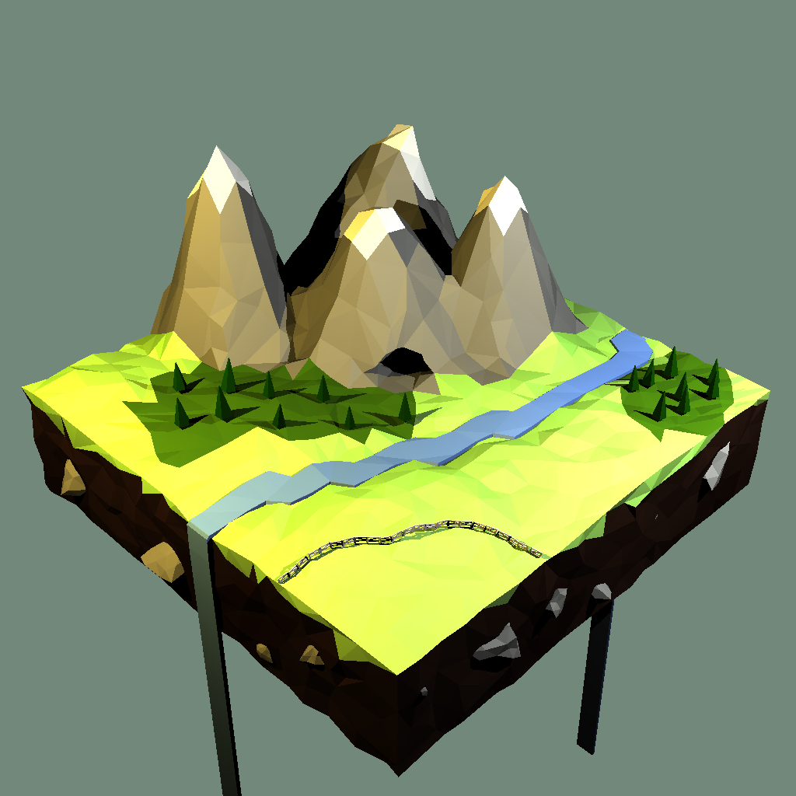
</Figure>

<Figure caption="Rendered in 2373 ms">
  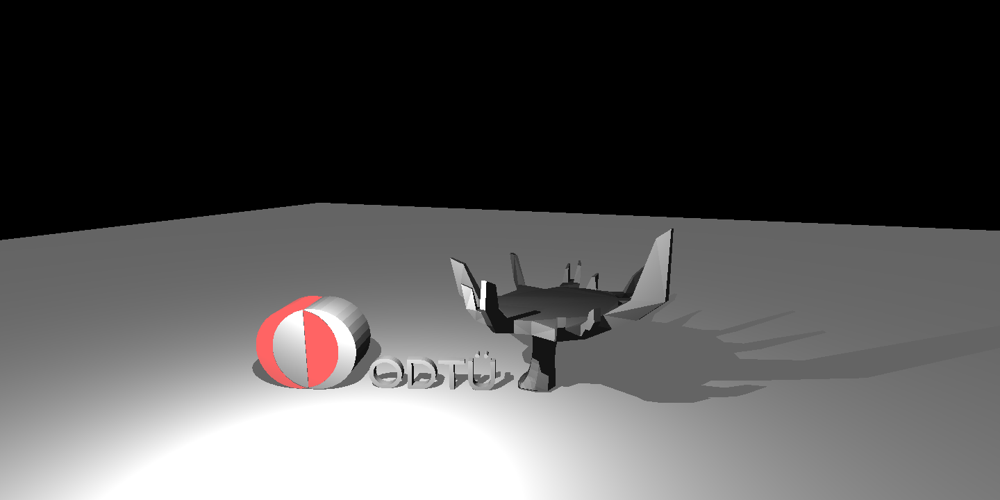
</Figure>

<Figure caption="Rendered in 23939 ms">
  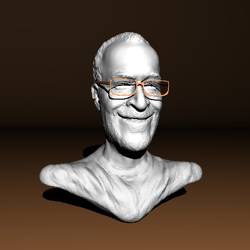
</Figure>

## Result and Future Work

In the end, I have a basic ray tracer that can handle multiple kinds of materials and triangle intersections. However, without the acceleration structures, the process is slow. In future iterations, a Bounding Volume Hierarchy or k-d tree implementation is needed.

## References

“Peter Shirley, Trevor David Black, Steve Hollasch. Ray Tracing in One Weekend.” raytracing.github.io/books/RayTracingInOneWeekend.html

Ahmet Oğuz Akyüz, Lecture Slides from CENG795 Advanced Ray Tracing, Middle East Technical University
