import Figure from "@/components/Figure.astro";

In this project we will see how can we render procedural terrains using OpenGL with Perlin Noise. To optimize these calculations we will use geometry shaders to generate terrain on our GPU.

<Figure caption="">
  
</Figure>

## Terrain Rendering

Terrain rendering without many repetitions is a big help while modelling and rendering large and open environments. The main examples for this kind of task is games. While rendering these terrains we need a way to achieve the wanted effect without a performance penalty. 

To outcome these performance challenges, we can use things like culling or chunk rendering, but the most basic performance improvement will come from making these calculations parallel on a GPU. 

Besides from the performance issues, we still need a way to create these good looking non-repeating surfaces. In the next section we will dive into noise to create these effects on our programs.

## Noise

Noise mostly refers to many types of random and troublesome siganls or noises. In our case we need it to create random things happen in our deterministic computers.

<Figure caption="">
  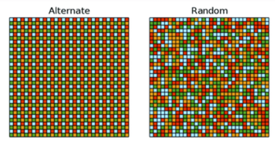
</Figure>

We need some kind of randomness while creating realistic things, because the nature is fully-random. From the scattering of leaves to the distrubition of moss on a wall. 

<Figure caption="">
  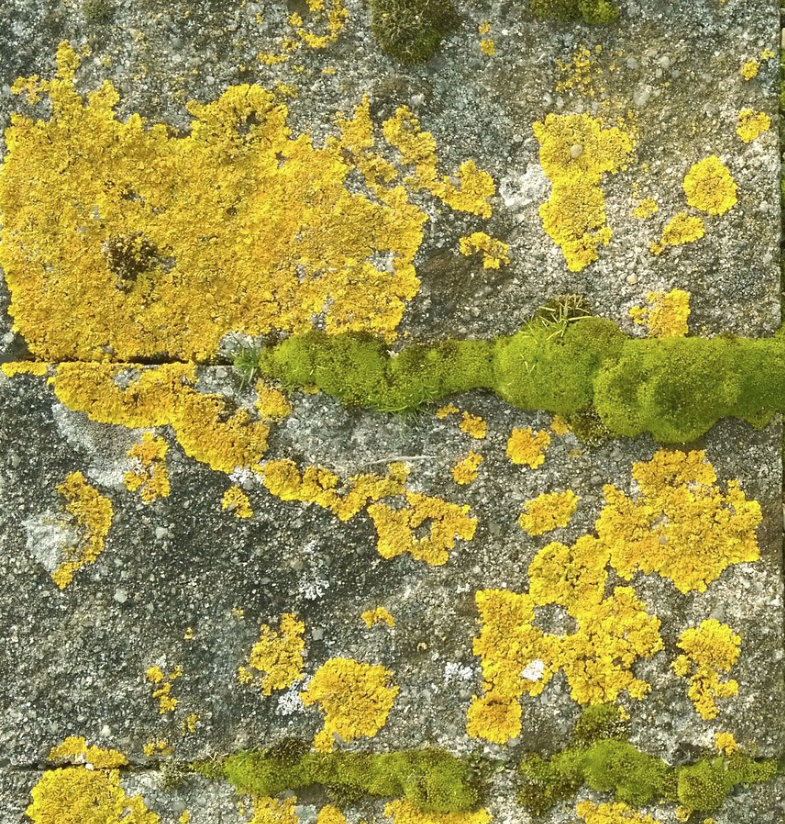
</Figure>

To achieve this kind of effect on our programs we need pseudo-random algorithms which are not fully random algorithms but trying to achieve same results in our deterministic computers. In this project we will use Perlin Noise which is introcuded by Ken Perlin in 1983. Before introducing the Perlin Noise I want to talk about how can we create our surfaces in GPU using geometry shaders.

## Geometry Shaders

The geometry shaders are used to create primitives like points, lines and triangles. It is executed after vertex shader. It will convert the data coming from vertex shader into some other primitives. It also may emit no primitive as a result of a different algorithm. 

In our case we need a basic surface consists triangles. To do that we can use some feature called instanced rendering. In our OpenGL program on CPU, we don't want to make any calculations. However, we still need to make enough draw calls to populate them into a surface. In the end we want to use geometry shaders to do the work. Thus, we can send points from CPU to GPU for converting them into triangles (triangle strips in our case). However, the surface we wanted to create has lots of polygons to draw, so calling a draw function for each one of them is not efficient. 

The solution is making a single point draw call with an instance count. This call will create multiple copies of our point and will send them to our shaders. To differentiate and place them in their position, we need a way to know which point we are handling. The shader has a built in variable for instanced draw calls just for that. With our basic algorithm in the geometry shader we can easily turn our multiple copies of same point into a surface with triangular faces.

<Figure caption="">
  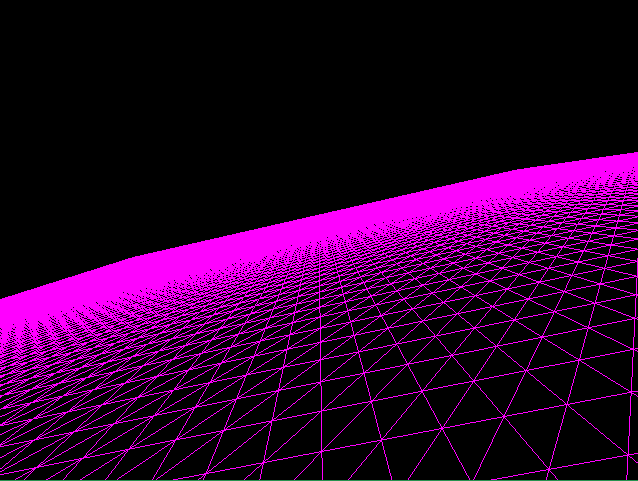
</Figure>

We created our surface without any fun, so lets have a look into perlin noise to what can we do about it.

## Perlin Noise

Perlin Noise is a procedural pseudo-random texture generation algorithm to improve the realism into computer graphic programs. The algorithm takes inputs in 2D or 3D to generate a random floating point number in the range of (-1, 1). 

The algorihm generates the output in two steps. The first step is choosing gradients from a precomputed selections. We select these gradient vectors for each vertex of our imaginary grid.

<Figure caption="">
  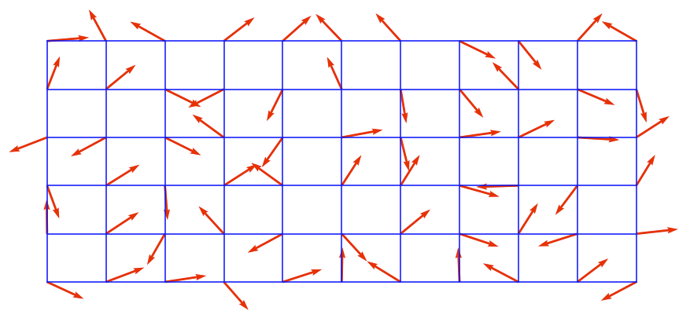
</Figure>

In the next step we put our input into the grid and calculate the weights of these gradients and accumulate the result of the dot product of these vectors with the difference vectors with the weights that we have calculated.

<Figure caption="">
  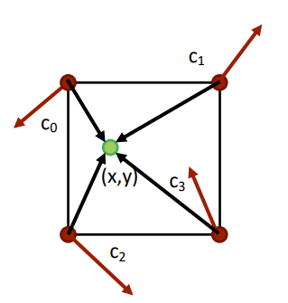
</Figure>

In the end we will have a texture like this if we want to map the color of the pixels in greyscale to the result of perlin noise algorithm.

<Figure caption="A texture output of perlin noise algorithm.">
  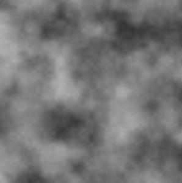
</Figure>

In the next section we will apply these randomness in our surface as height values.

## A Problem with Pseudo-Randomness

While creating our beatiful surface, I just tossed the perlin noise function into the height values of the triangles that we created on our geometry shader. 

However, while creating our noise function I missed a crucial step. While selecting gradient vectors from a list, I used the code below which takes the floor of our position and then with these values takes modulo and in each step we hope the randomize the result. 

<Figure caption="">
  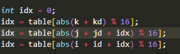
</Figure>

I did thought that the code above is enough to create a random values, the little that I know it wasn't enough. Let's have a look at what is wrong.

In my index code I use a index array to shuffle things more. So I just insterted these values in ascending order like below. 

<Figure caption="">
  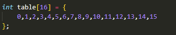
</Figure>

However, in my implementation I got a result which can called repetitive. 

<Figure caption="Output from my code which I colorized each square as the gradient vector of the left bottom vertex of the each square of the grid.">
  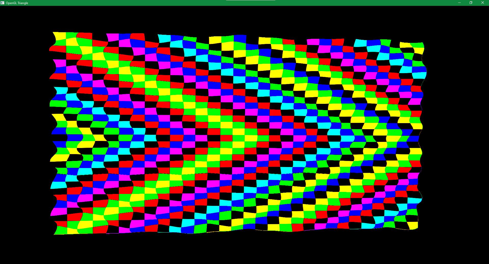
</Figure>

When I see this shape, first I noticed that the diagonals. After some thinking, I noticed that the summation of the 2D coordinates of these squares are equal. Then, I looked at my index function to realize that with a non-shuffled index array I am only calculating the modulo of the total coordinate values because there is a one to one correspondence with the index of the array and the value inside of it. I shuffled the array and I got much better results.

<Figure caption="">
  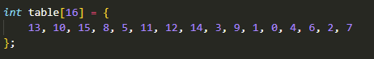
</Figure>

<Figure caption="Gradient vectors after shuffle.">
  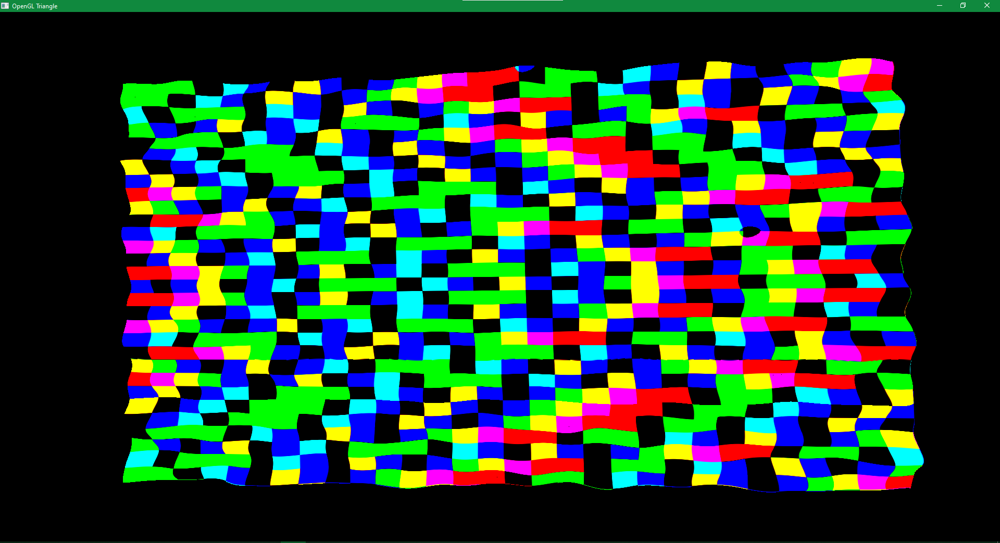
</Figure>

<Figure caption="A resulting surface which colorized according to the y values of the positions.">
  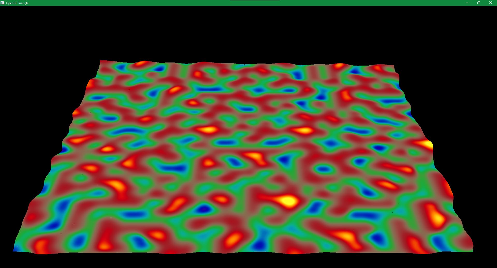
</Figure>

<Figure caption="Wireframe version of the same surface.">
  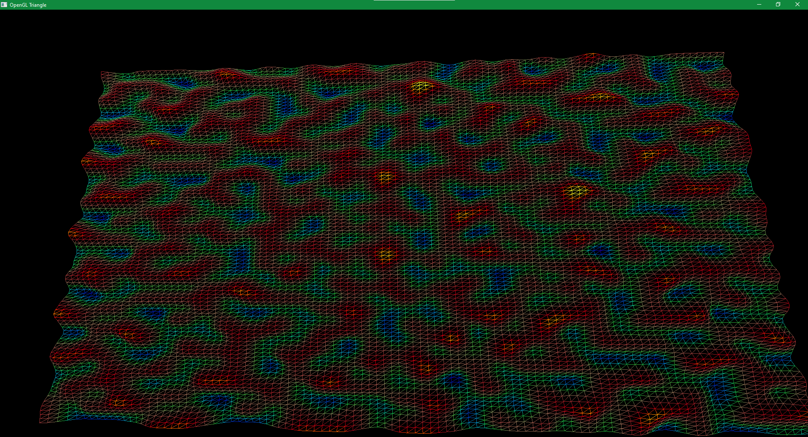
</Figure>

## Different Frequencies of Same Noise

While trying to implement the perlin noise algoritm I wondered that what happens If I don't want to have too bumpy surface. To solve this issue I searched and find out that we can change the frequency of the noise function with scaling down or up the position values itself before putting them into the perlin noise algorithm.

Here are the results of different frequencies.

<Figure caption="High frequency perlin noise.">
  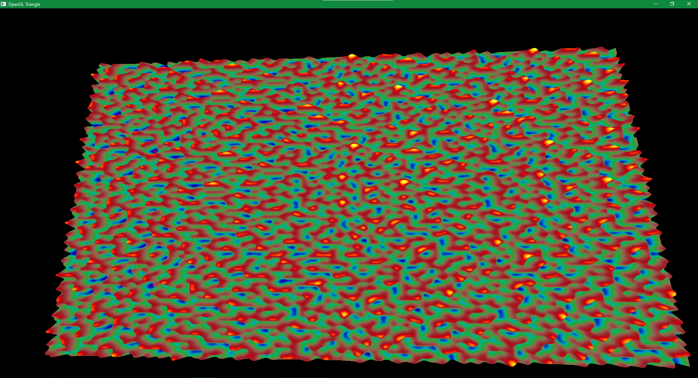
</Figure>

<Figure caption="Low frequency perlin noise.">
  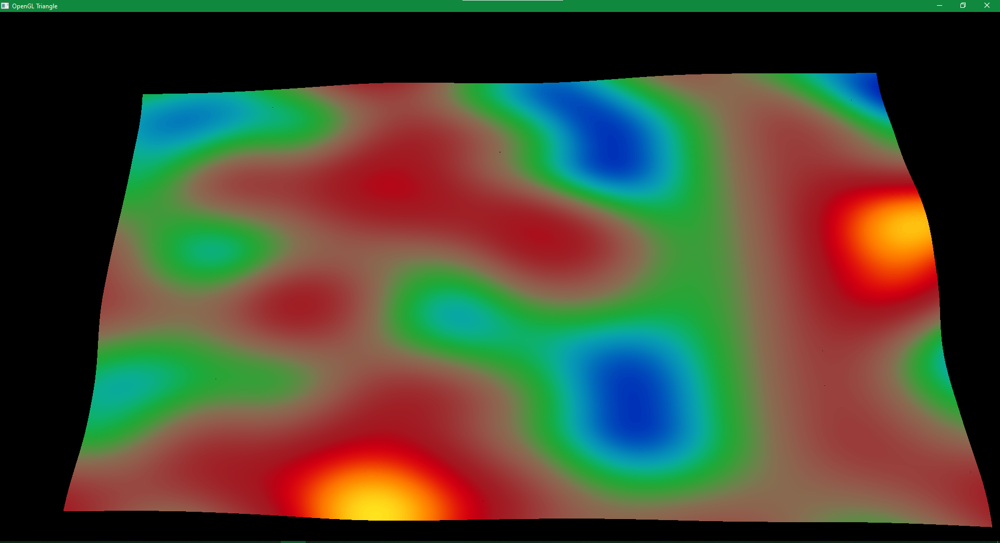
</Figure>

## Example Camera Movement

Looking the surface from sky is good, but we can do something better we can ride our car in these surface. Or at least we can simulate the vision of the ride. We can achieve this by calculating the same noise on the CPU side and change the camera parameters according to that. 

In my implementation I first thought to recreating the square which we are currently on on the CPU, but I noticed that this is unneccessary. I only need to height value of a step ahead on my direction. Thus, I calculated the height of my current position and the summation of my current position and my direction vector to calculate my new direction. 

<Figure caption="">
  
</Figure>

After implementing the camera I implement some parameters to change the number of triangles and the size of the surface we wanted to render.

<Figure caption="Low poly version of our surface.">
  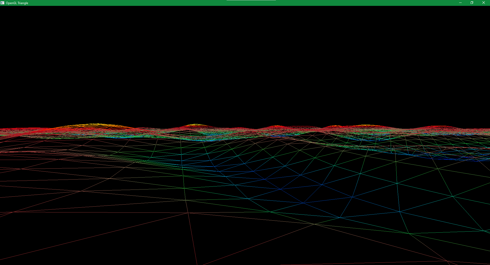
</Figure>

<Figure caption="I also scaled the height outputs from perlin noise to experiment a little.">
  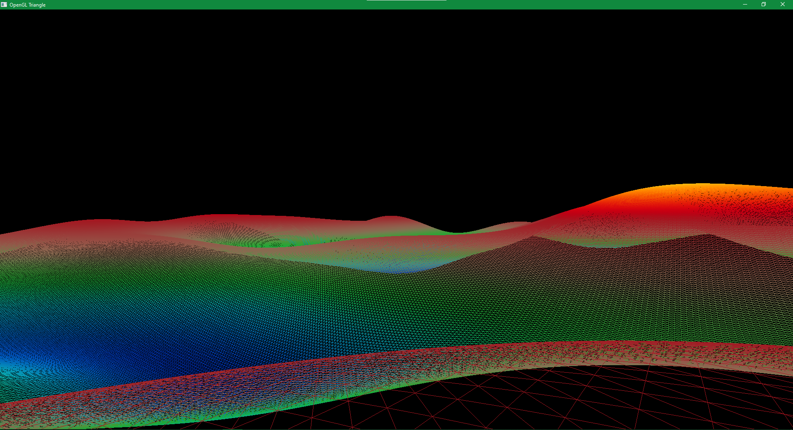
</Figure>

<Figure caption="High frequency surface from our new camera.">
  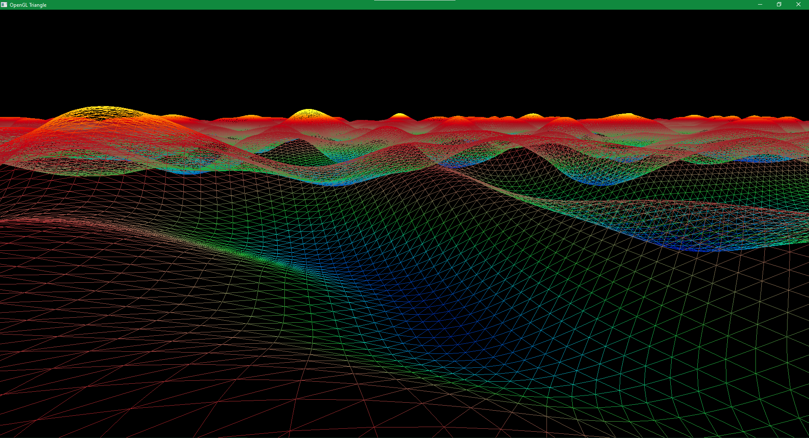
</Figure>

## Final Words

<Figure caption="A final rendered surface.">
  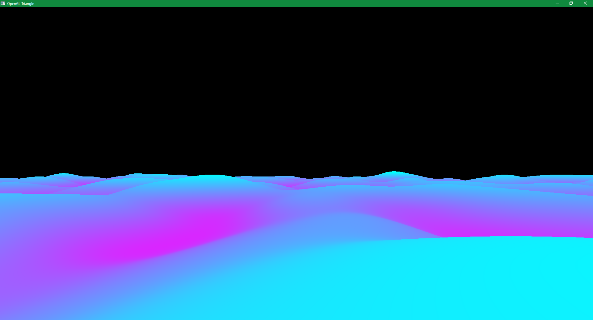
</Figure>

While implementing this project, I noticed that creating random stuff on our computers is actually impossible due to their nature. However, for the visual applications the randomness we get from these different kind of algorithms is enough. In my future projects, I want to try these different algorithms on some other applications like smoke or cloud rendering.
